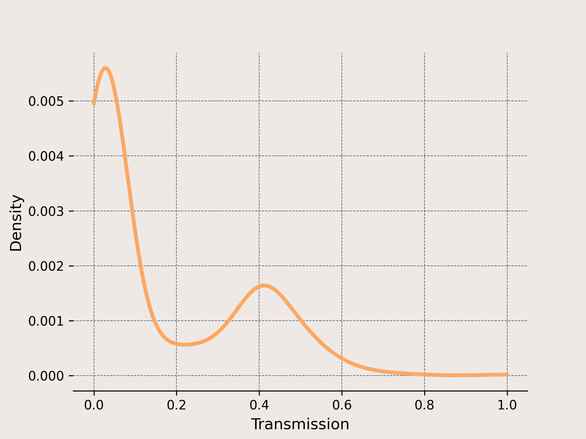

## TSPE-GS: RaDe-GS + TSPE

基于高斯溅射（Gaussian Splatting）的 3D 重建 / 渲染项目，实现并扩展了 RaDe-GS 与 TSPE 相关方法，用于在多视图场景下进行高质量重建与评估。

- **Repository**: `https://github.com/nortonii/TSPE-GS`
- **Frameworks**: PyTorch, CUDA
- **Typical tasks**: 训练、评估、网格提取（mesh extraction）、在 DTU / BlendedMVS 等数据集上的实验复现

---

## 1. 环境配置（Environment）

建议使用 Conda 创建独立环境（Python 3.8+）：

```bash
conda create -n tspe-gs python=3.8 -y
conda activate tspe-gs
```

安装基础依赖（`requirements.txt` 中列出的）：

```bash
pip install -r requirements.txt
```

`requirements.txt` 当前包含：

- open3d  
- trimesh  
- scikit-image  
- opencv-python  
- plyfile  
- tqdm  

此外，本仓库依赖以下子模块（在 `submodules/` 下），请确保在克隆仓库时拉取子模块：

```bash
git clone --recursive https://github.com/nortonii/TSPE-GS.git
cd TSPE-GS
```

如果你已经克隆过但没有子模块，可以执行：

```bash
git submodule update --init --recursive
```

---

## 2. 硬件要求（Hardware）

- **GPU**: 至少 1 块支持 CUDA 的 GPU（建议 12GB 显存或更高）
- **CUDA**: 已正确安装 CUDA 与对应版本的驱动
- **内存**: 16GB+ 推荐（取决于数据集规模）

训练脚本中会使用 `nvidia-smi` 查询显存占用，并设置 `CUDA_VISIBLE_DEVICES`；若需要使用其他 GPU，可直接修改 `train.py` 中对应代码或在外部设置环境变量：

```bash
export CUDA_VISIBLE_DEVICES=0
```

---

## 3. 数据准备（Datasets）

本仓库包含对多种数据集的支持（从脚本名可见，如 `runbmvs*.sh`, `rundtu*.sh` 等）。典型数据集包括：

- **DTU**: 经典多视图 3D 重建数据集  
- **BlendedMVS / MVS** 系列：多视图立体重建数据集  
- 其它自定义场景（参见 `scene/` 与 `eval/` 目录）

### 3.1 数据组织格式

通常需要：

- 已经过 COLMAP 或类似 SfM 工具处理得到的相机参数 / 稀疏点云  
- 逐视角的图像序列  

数据加载逻辑主要位于：

- `scene/colmap_loader.py`
- `scene/dataset_readers.py`

请根据你当前的数据路径调整对应脚本中的 `source_path` 或相关配置。

---

## 4. 训练与评估（Training & Evaluation）

根目录下已经提供了若干 `.sh` 脚本来一键运行完整流程（训练 + 评估 + 网格导出），例如：

- `runtrain.sh`：默认训练脚本（可根据需要修改内部参数）
- `rundtu.sh`, `rundtueval.sh`, `rundtumesh.sh`：在 DTU 数据集上的训练 / 评估 / 网格提取
- `runbmvs.sh`, `runbmvseval.sh`, `runbmvsmesh.sh`：在 BlendedMVS / MVS 数据集上的训练 / 评估 / 网格提取
- 其他以 `run*.sh` 开头的脚本：针对不同场景或实验设置的一键运行脚本

### 4.1 基本用法示例

以 DTU 为例（假设你已经在脚本内部配置好数据路径）：

```bash
# 训练
bash rundtu.sh

# 评估
bash rundtueval.sh

# 提取重建网格
bash rundtumesh.sh
```

以 MVS 实验为例：

```bash
# 训练
bash runbmvs.sh

# 评估
bash runbmvseval.sh

# 提取重建网格
bash runbmvsmesh.sh
```

上述脚本会**自动运行完整实验流程**，包括训练和评估，并在结束时**输出最终的精度指标**（如 PSNR / 准确率等，具体见 `metric.py` 与各 `*_eval` 目录下的脚本）。

你也可以直接调用 Python 脚本，例如（根据你的实际参数进行替换）：

```bash
python train.py --config <your_config>
python render.py --scene <scene_path>
```

---

## 5. 结果示例（Example Outputs）

项目中包含若干可视化脚本和工具：

- 网格提取相关脚本：如 `mesh_extract.py`, `mesh_extract_opa.py` 及其变体
- 深度 / 法线可视化：通过 `utils/vis_utils.py` 和 `utils/image_utils.py` 中的工具

训练与评估完成后，你可以获得：

- 渲染图像 / 视频
- 重建网格（如 `.ply` 文件，示例：`poisson_mesh.ply`）
- 定量指标（PSNR / 其他评测指标）

你可以在 README 中插入你自己的结果图，例如：

```markdown

```

---

## 6. 引用（Citation）

如果你在学术工作中使用了本仓库，请引用对应的论文和/或原始 RaDe-GS / TSPE 工作，例如：

```bibtex
@article{tspe_gs,
  title   = {TSPE-GS},
  author  = {Author et al.},
  journal = {Journal/Conference},
  year    = {2025}
}
```

请同时引用 RaDe-GS、TSPE、3D Gaussian Splatting 等相关上游工作。

---

## 7. 致谢（Acknowledgments）

本项目基于 / 参考了以下工作和代码实现（不完全列表）：

- **3D Gaussian Splatting**（原始高斯溅射代码实现）
- **RaDe-GS** 相关代码与论文
- **TSPE** 相关代码与论文
- 本仓库所使用的第三方库与子模块（如 `diff-gaussian-rasterization`, `simple-knn` 等）

后续版本中会进一步补充和完善致谢列表。
